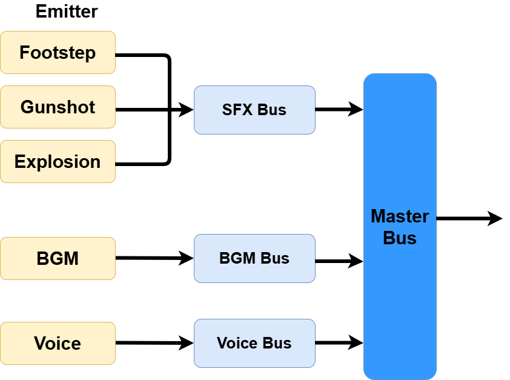
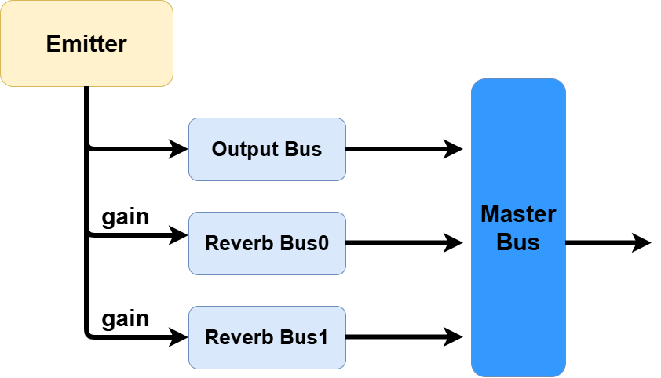

# AudioApi
## Audio Systemの概要


本エンジンで使用するAudio Systemには大きく、BGMやSEなどの音であるAudio、音源であるEmitter、音の出力先であるBusの3つの概念があります。AudioはEmitterから発せられ、Busを経由してMaster Busで統合され、最終的にスピーカーやヘッドフォンなどから音が出力されます。
本エンジンはECSを採用しており、Audioに関するComponentをEntityに付与し、音を再生することで、Audio Systemが音を再生します。
```rust
pub struct AudioSource{
    pub audio: AudioAssetId,
    pub emitter: Option<AudioEmitterId>,
    pub settings: PlaybackSettings,
}
```
上記のようなComponentをEntityに付与することで、Entityに音を発するという属性をつけることができます。
```rust
let play_emitter = context.play_on_emitter(
    "neko",
    "emitter0",
    PlaybackSettings {
        volume: 1.0,
        looping: true,
    },
);
let play_bus=context.play_on_bus(
    "bgm",
    "bgm_bus",
    PlaybackSettings { volume: 1.0, looping: true }
);
let play_master=context.play(
    "wind",
    PlaybackSettings { volume: 1.0, looping: false}
);
```
さらに、上記のようにEmitter対してや、Bus、Audioに対して音を再生することが出来ます。  
Entityに付与されたemitterから音を再生するか、Bus対して音を再生するか、Master Busに対して音を再生するかを選択することが出来ます。

## BusとEmitterの作成
もう一度`AudioSource`コンポーネントを見てみましょう
```rust
pub struct AudioSource{
    pub audio: AudioAssetId,
    pub emitter: Option<AudioEmitterId>,
    pub settings: PlaybackSettings,
}
```
`AudioEmitterId`はEmitterのIDを表す型で、Emitterを作成すると作れます。ではEmitter作成の方法を見てみましょう。
```rust
fn create_emitter(&mut self, name: &str, settings: AudioEmitterSettings)
```
emitter作成APIです。`name`はEmitterに付ける名前で、`settings`はEmitter設定です。
```rust
pub struct AudioEmitterSettings{
    pub output: AudioBusId, // Emitterのメインの出力先Bus
    pub volume: f32, // EmitterがBusに出力する音量
    pub panning: f32, // EmitterがBusに出力する音のパンニング 左-1.0, 右1.0
    pub sends: Vec<AudioSend>, // Emitterのサブの出力先Bus
}
```
```rust
pub struct AudioSend{
    pub bus: AudioBusId,
    pub gain: f32,
}
```

このように、Emitterは少なくとも`output`フィールドで、出力先のBusを1つ指定する必要があります。必要に応じて、`sends`フィールドで、別の複数Busに音を送ることが出来ます。`sends`に送る音の例としては、音が壁にぶつかったときの反響音や、回折音などの効果音があります。これらを`sends`で指定したBusに送ることで、音の表現を豊かにすることができます。  
ここからわかるように、Emitter作成にはBusを指定する必要があり、あらかじめBus作成しておく必要があります。ただ、シンプルにMaster Busに音を送るだけであれば、Busを作成する必要はありません。
```rust
context.create_emitter(
    "output_master",
    AudioEmitterSettings{
        output: context.master_bus()?,
        volume: 1.0,
        panning: 0.0,
        sends: vec![],
    }
);
```
では、Bus作成の方法を見てみましょう。
```rust
fn create_bus(&mut self, name: &str, settings: AudioBusSettings)
```
```rust
pub struct AudioBusSettings{
    pub volume: f32,
    pub panning: f32,
    pub bus_type: AudioBusType,
}
```
```rust
pub enum AudioBusType{
    Sub{
        output: AudioBusId,
    },
    Reverb{
        settings: ReverbSettings,
    }
}
```
```rust
pub struct ReverbSettings {
    pub feedback: f64,     // Controls how much of the reverberated signal is fed back into the effect.
    pub damping: f64,      // Controls how quickly high-frequency sounds are attenuated in the reverb.
    pub stereo_width: f64, // Controls the perceived width of the reverb in the stereo field.
}
```
`create_bus()`でBusを作成することが出来ます。BusはEmitter同様、名前を選択し、Busの設定を指定する必要があります。`AudioBusSettings`では、`volume`でBusから出力する音の大きさを、`panning`で左右の音量バランスを、`bus_type`でBusの種類を指定することが出来ます。  
Busの種類は、`Sub`と`Reverb`の2種類があります。`Sub`はEmitterからの音を受け取り、指定されたBusに音を送るBusです。`Reverb`はEitterからの音を受け取り、反響音を生成して出力するBusです。  
`Sub`属性のBusは、音量とパンニングを指定するだけのシンプルなBusですが、
```
SubBus0 -> SubBus1 -> ... -> MasterBus
```
のように、Busを階層的に作ることが出来ます。ここでBusから出力される音は、親のBusから出力された音にBusの`volume`と`panning`を乗算した音になります。  
`Reverb`属性のBusは、反響音を生成するBusです。`ReverbSettings`で反響音の特性を指定することが出来ます。
```
ReverbBus0 -> MasterBus
```
RevervBusは、直接MasterBusに出力されます。  
Bus作成例
```rust
context.create_bus(
    "bgm_bus",
    AudioBusSettings{
        volume: 1.0,
        panning: 0.0,
        bus_type: AudioBusType::Sub{
            output: context.master_bus()?,
        }
    }
)

context.create_bus(
    "water_bus",
    AudioBusSettings{
        volume: 1.0,
        panning: 0.0,
        bus_type: AudioBusType::Reverb{
            settings: ReverbSettings{
                feedback: 0.7,
                damping: 0.8,
                stereo_width: 0.5,
            }
        }
    }
)
```

Emitter作成例
```rust
context.create_emitter(
    "emitter0",
    AudioEmitterSettings{
        output: context.audio_bus_id("bgm_bus")?,
        volume: 1.0,
        panning: 0.0,
        sends: vec![
            AudioSend{
                bus: context.audio_bus_id("water_bus")?,
                gain: 1.0,
            }
        ]
    }
)
```

最後に、EmitterとBusの関係を図で表すと以下のようになります。


## Audioのロード
```rust
pub struct AudioSource{
    pub audio: AudioAssetId,
    pub emitter: Option<AudioEmitterId>,
    pub settings: PlaybackSettings,
}
```
`AudioSource`コンポーネントの`audio`フィールドは、ロードされたAudioのIDを指定する必要があります。Audioは、appから`load_audio()`で同期ロード、または`request_load_audio()`で非同期ロードすることが出来ます。
```rust
let audio_id=app.load_audio("neko", "assets/sounds/sample_sound.mp3")?;
```

```rust
let audio_id=context.request_load_audio("neko", "assets/sounds/sample_sound.mp3");
```

## 再生と停止
Entityに`AudioSource`コンポーネントを付与することで、Entityに音を発するという属性を付与することが出来ました。ただ、このままでは再生されません。再生させるには`play()`を使用します。

```rust
let play_emitter = context.play_on_emitter(
    "neko",
    "emitter0",
    PlaybackSettings {
        volume: 1.0,
        looping: true,
    },
);
let play_bus=context.play_on_bus(
    "bgm",
    "bgm_bus",
    PlaybackSettings { volume: 1.0, looping: true }
);
let play_master=context.play(
    "wind",
    PlaybackSettings { volume: 1.0, looping: false}
);
```
すると、`PlaybackId`という1再生に対応したIDが返ります。  

停止させるには`stop()`を使用します。`PlaybackId`を指定します。
```rust
fn stop(&mut self, playback: AudioPlaybackId, fade_seconds: f32)
```
```rust
context.stop(play_emitter,0.4)
```

`fade_seconds`で停止するまでの秒数を指定することが出来ます。  
一時停止、再開も同じです
```rust
fn pause(&mut self, playback: AudioPlaybackId, fade_seconds: f32) 
fn resume(&mut self, playback: AudioPlaybackId, fade_seconds: f32) 
```

## EmitterとBusの設定変更
プレイヤーと音を発するオブジェクト (`AudioSource`を持ったEntity) の位置関係に応じて、ボリュームやパンニングを動的に調整したいことがあります。`set_bus_volume()`や`set_emitter_panning()`を用いて、それらを変更することが出来ます。変更されたら、即座に各Playbackに適用されます。
```rust
    fn set_playback_volume(&mut self, playback: AudioPlaybackId, volume: f32, fade_seconds: f32) 

    fn set_bus_volume(&mut self, bus: &str, volume: f32, fade_seconds: f32) -> Result<()> 
    fn set_bus_volume_from_id(&mut self, bus: AudioBusId, volume: f32, fade_seconds: f32)

    fn set_bus_panning(&mut self, bus: &str, panning: f32, fade_seconds: f32) -> Result<()>
    fn set_bus_panning_from_id(&mut self, bus: AudioBusId, panning: f32, fade_seconds: f32)

    fn set_bus_reverb(&mut self, bus: &str, settings: ReverbSettings, fade_seconds: f32) -> Result<()> 
    fn set_bus_reverb_from_id(&mut self, bus: AudioBusId, settings: ReverbSettings, fade_seconds: f32) 

    fn set_emitter_volume(&mut self, emitter: &str, volume: f32, fade_seconds: f32) -> Result<()>
    fn set_emitter_volume_from_id(&mut self, emitter: AudioEmitterId, volume: f32, fade_seconds: f32)

    fn set_emitter_panning(&mut self, emitter: &str, panning: f32, fade_seconds: f32) -> Result<()>
    fn set_emitter_panning_from_id(&mut self, emitter: AudioEmitterId, panning: f32, fade_seconds: f32) 
```

## EmitterとBusの削除
使用しなくなったEmitterとBusは削除する必要があります。Entityを消しただけでも、EmitterやBusは残ります。そのため、ユーザは明示的にこれらを消すのです。
```rust
    fn destroy_emitter(&mut self, emitter: &str) -> Result<()> 
    fn destroy_emitter_from_id(& mut self, emitter: AudioEmitterId)

    fn destroy_bus(&mut self, bus: &str) -> Result<()> 
    fn destroy_bus_from_id(&mut self, bus: AudioBusId)
```


## Example
この例では、Emitterに複数のBusを持たせてカメラと音源の位置関係に応じて、Busごとのパンニングと音の大きさを変化させます。  

`audio_scene.rs`
```rust
use super::ChangeSceneCommand;
use crate::system::{AudioSystem, MoveRotateSystem};
use crate::component::{MoveRotateComponent};
use anyhow::{Result, anyhow};
use cgmath::{vec2, vec3};
use kani_volcano_audio::ReverbSettings;
use kani_volcano_engine::prelude::*;
use kani_volcano_math::Transform;
use std::collections::HashMap;
use winit::keyboard::KeyCode;

pub struct AudioScene {
    scene_id: SceneId,
    main_cube: Option<EntityId>,
    ground: f32,
    // emitter, output_bus, buses
    buses: HashMap<String, (String, Vec<String>)>,
}

impl Scene for AudioScene {
    fn name(&self) -> String {
        "AudioScene".to_string()
    }

    fn on_enter(&mut self, context: &mut SceneContext<'_>) -> Result<()> {
        self.scene_id = context.scene_id();
        context.set_skybox("default")?;
        self.create_camera(context)?;
        self.create_fundation(context)?;
        self.create_texts(context)?;
        self.create_cuboid(context)?;
        //self.load_audio(context)?;
        self.create_buses(context)?;

        // Names are available before the deferred audio registration completes.
        self.buses = (0..2)
            .map(|index| {
                (
                    format!("emitter{index}"),
                    (
                        format!("direct_{index}"),
                        ["water", "wood", "steel"]
                            .into_iter()
                            .map(|tag| format!("{tag}_{index}"))
                            .collect(),
                    ),
                )
            })
            .collect();
        self.add_update_systems(context);

        self.bind_input_commands(context);
        Ok(())
    }

    fn update(&mut self, context: &mut UpdateContext<'_>) -> Result<()> {
        let Some(cube) = self.main_cube else {
            return Ok(());
        };
        let Some(mesh_id) = context.mesh_asset_id(cube) else {
            return Ok(());
        };
        if !self.create_emitters(context)? {
            return Ok(());
        }
        if self.create_audio_objects(context, mesh_id)? {
            self.create_blocking_objects(context, mesh_id)?;
            self.play_audio(context)?;
            self.main_cube = None;
        }
        Ok(())
    }

    fn on_exit(&mut self, context: &mut SceneContext<'_>) -> Result<()> {
        self.main_cube = None;
        // Emitters must be removed before the buses they reference.
        for index in 0..2 {
            let name = format!("emitter{index}");
            if context.audio_emitter_id(&name).is_ok() {
                context.destroy_emitter(&name)?;
            }
        }
        for index in 0..2 {
            for kind in ["direct", "water", "wood", "steel"] {
                let name = format!("{kind}_{index}");
                if context.audio_bus_id(&name).is_ok() {
                    context.destroy_bus(&name)?;
                }
            }
        }
        Ok(())
    }
}

impl AudioScene {
    fn create_camera(&mut self, context: &mut SceneContext<'_>) -> Result<()> {
        let camera = context.spawn();
        context.add_component(camera, Transform::default());
        let success = context.add_component(
            camera,
            Camera {
                target: vec3(-5.0, 0.0, 0.0),
                up: vec3(0.0, 0.0, 1.0),
                fov_y: 45.0,
                near: 0.1,
                far: 100.0,
                yaw: std::f32::consts::PI,
                pitch: 0.0,
            },
        );

        if !success {
            Err(anyhow!("failed to create Camera"))
        } else {
            Ok(())
        }
    }

    fn load_audio(&self, context: &mut SceneContext<'_>) -> Result<()> {
        context.request_load_audio("neko", "assets/sounds/sample_sound.mp3");
        context.request_load_audio("flog", "assets/sounds/sample_sound2.mp3");
        Ok(())
    }

    fn create_buses(&self, context: &mut SceneContext<'_>) -> Result<()> {
        let master = context.master_bus()?;
        for index in 0..2 {
            context.create_bus(
                &format!("direct_{index}"),
                AudioBusSettings {
                    volume: 1.0,
                    panning: 0.0,
                    bus_type: AudioBusType::Sub { output: master },
                },
            );
            // Starting values for material effects; tune these by ear.
            for (material, feedback, damping, stereo_width, volume) in [
                ("water", 0.7, 0.8, 0.5, 0.0),
                ("wood", 0.35, 0.7, 0.3, 0.0),
                ("steel", 0.8, 0.2, 0.8, 0.0),
            ] {
                context.create_bus(
                    &format!("{material}_{index}"),
                    AudioBusSettings {
                        // A blocking system can fade in each effect independently.
                        volume,
                        panning: 0.0,
                        bus_type: AudioBusType::Reverb {
                            settings: ReverbSettings {
                                feedback,
                                damping,
                                stereo_width,
                            },
                        },
                    },
                );
            }
        }
        Ok(())
    }

    fn create_emitters(&mut self, context: &mut UpdateContext<'_>) -> Result<bool> {
        let mut ready = true;
        for index in 0..2 {
            let name = format!("emitter{index}");
            // Audio registration runs between updates; skip registered emitters.
            if context.audio_emitter_id(&name).is_ok() {
                continue;
            }
            ready = false;
            let (Ok(output), Ok(water), Ok(wood), Ok(steel)) = (
                context.audio_bus_id(&format!("direct_{index}")),
                context.audio_bus_id(&format!("water_{index}")),
                context.audio_bus_id(&format!("wood_{index}")),
                context.audio_bus_id(&format!("steel_{index}")),
            ) else {
                continue;
            };
            context.create_emitter(
                &name,
                AudioEmitterSettings {
                    output,
                    volume: 1.0,
                    panning: 0.0,
                    sends: vec![
                        AudioSend {
                            bus: water,
                            gain: 1.0,
                        },
                        AudioSend {
                            bus: wood,
                            gain: 1.0,
                        },
                        AudioSend {
                            bus: steel,
                            gain: 1.0,
                        },
                    ],
                },
            );
        }
        Ok(ready)
    }

    fn add_update_systems(&mut self, context: &mut SceneContext<'_>) {
        context.add_update_system("camera", CameraSystem);
        context.add_update_system(
            "audio",
            AudioSystem {
                buses: self.buses.clone(),
            },
        );
        context.add_fixed_update_system("rotator", MoveRotateSystem);
    }

    fn create_fundation(&mut self, context: &mut SceneContext<'_>) -> Result<()> {
        context.spawn_rectangle_3d(
            vec3(0.0, 0.0, self.ground),
            30.0,
            30.0,
            vec3(0.0, -90.0, 0.0),
            vec3(0.5, 0.5, 0.5),
            1.0,
            None,
            PipelineKey::Mesh3D,
        )?;

        Ok(())
    }

    fn create_cuboid(&mut self, context: &mut SceneContext<'_>) -> Result<()> {
        let height = 1.0;
        let cuboid = context.spawn_cuboid_3d(
            vec3(0.0, 0.0, height / 2.0),
            1.0,
            1.0,
            height,
            vec3(0.0, 0.0, 0.0),
            vec3(1.0, 1.0, 1.0),
            1.0,
            None,
            PipelineKey::Lit3D,
        )?;
        self.main_cube = Some(cuboid);
        if let Some(visibility) = context.get_component_mut::<Visibility>(cuboid) {
            visibility.is_visible = false;
        }
        Ok(())
    }

    fn create_audio_objects(
        &self,
        context: &mut UpdateContext<'_>,
        mesh_id: MeshAssetId,
    ) -> Result<bool> {
        // Resolve every dependency before spawning either bill.
        let (Ok(neko), Ok(flog), Ok(emitter0), Ok(emitter1)) = (
            context.audio_asset_id("neko"),
            context.audio_asset_id("flog"),
            context.audio_emitter_id("emitter0"),
            context.audio_emitter_id("emitter1"),
        ) else {
            return Ok(false);
        };
        let height = 7.0;
        let width = 2.0;
        let texture = context.default_texture();
        let items = [
            // position, color, audio, emitter
            (vec2(-8.0, -8.0), vec3(1.0, 1.0, 0.0), neko, emitter0),
            (vec2(8.0, 8.0), vec3(0.0, 1.0, 1.0), flog, emitter1),
        ];
        for item in items {
            let bill = context.spawn_primitive_from_mesh(
                mesh_id,
                Material {
                    color: item.1,
                    alpha: 1.0,
                    use_texture: false,
                    texture: texture,
                    pipeline_key: PipelineKey::Lit3D,
                },
                Transform {
                    position: vec3(item.0.x, item.0.y, self.ground + height / 2.0 ),
                    rotation: vec3(0.0, 0.0, 0.0),
                    scale: vec3(width, width, height),
                },
            )?;

            context.add_component(
                bill,
                SceneOwned {
                    scene_id: self.scene_id,
                },
            );
            context.add_component(
                bill,
                AudioSource {
                    audio: item.2,
                    emitter: Some(item.3),
                    settings: Default::default(),
                },
            );
        }
        Ok(true)
    }

    fn create_blocking_objects(
        &self,
        context: &mut UpdateContext<'_>,
        mesh_id: MeshAssetId,
    ) -> Result<()> {
        let texture = context.default_texture();
        let items = [
            // position, size, color, alpha, Pipeline, name
            (
                vec2(-5.0,5.0),
                3.0,
                vec3(0.4, 0.4, 1.0),
                0.5,
                PipelineKey::Lit3D,
                "water",
            ),
            (
                vec2(0.0, 0.0),
                3.0,
                vec3(0.4, 0.2, 0.0),
                1.0,
                PipelineKey::Lit3D,
                "wood",
            ),
            (
                vec2(5.0, -5.0),
                3.0,
                vec3(0.1, 0.1, 0.1),
                1.0,
                PipelineKey::Lit3D,
                "steel",
            ),
        ];

        for item in items {
            let size = item.1;
            let obj = context.spawn_primitive_from_mesh(
                mesh_id,
                Material {
                    color: item.2,
                    alpha: item.3,
                    use_texture: false,
                    texture: texture,
                    pipeline_key: item.4,
                },
                Transform {
                    position: vec3(item.0.x, item.0.y, self.ground + size / 2.0+0.3),
                    scale: vec3(size, size, size),
                    ..Default::default()
                },
            )?;

            context.set_tags(obj, [item.5]);
            // Approximate the cube with an inscribed sphere in world units.
            context.add_component(
                obj,
                crate::component::SphereColliderComponent { radius: size / 2.0 },
            );
            context.add_component(
                obj,
                SceneOwned {
                    scene_id: self.scene_id,
                },
            );
        }

        Ok(())
    }

    fn play_audio(&mut self, context: &mut UpdateContext<'_>) -> Result<()> {
        let playback0 = context.play_on_emitter(
            "neko",
            "emitter0",
            PlaybackSettings {
                volume: 1.0,
                looping: true,
            },
        );
        let playback1 = context.play_on_emitter(
            "flog",
            "emitter1",
            PlaybackSettings {
                volume: 1.0,
                looping: true,
            },
        );

        Ok(())
    }

    fn create_texts(&mut self, context: &mut SceneContext<'_>) -> Result<()>{
        let audio_text=context.spawn_text_3d(
            "eng_font",
            "AudioScene",
            100.0,
            100.0,
            vec3(-3.0,-3.0,4.0),
            vec3(0.01,0.01,0.01),
            vec3(0.0,0.0,0.0),
            vec3(1.0,1.0,1.0),
            1.0,
        );
        Ok(())
    }

    fn bind_input_commands(&mut self, context: &mut SceneContext<'_>) {
        context.bind_input_command(
            KeyCode::Space,
            InputTrigger::Pressed,
            ChangeSceneCommand {
                next_scene: "TutorialScene".to_string(),
            },
        )
    }
}

impl Default for AudioScene {
    fn default() -> Self {
        Self {
            scene_id: SceneId(0),
            main_cube: None,
            ground: -1.0,
            buses: HashMap::new(),
        }
    }
}
```

`audio_system.rs`
```rust
use std::collections::HashMap;

use anyhow::Result;
use cgmath::{InnerSpace, Vector3};
use kani_volcano_engine::prelude::*;
use kani_volcano_math::Transform;

use crate::component::SphereColliderComponent;

#[derive(Clone, Debug, Default)]
pub struct AudioSystem {
    // Emitter name -> (direct bus name, material bus names).
    pub buses: HashMap<String, (String, Vec<String>)>,
}

impl UpdateSystem for AudioSystem {
    fn update(&mut self, context: &mut UpdateContext<'_>) -> Result<()> {
        let Some((_, transform, camera)) = context.query2::<Transform, Camera>().next() else {
            return Ok(());
        };
        let camera_pos = transform.position;
        let right = (camera.target - camera_pos).cross(camera.up);
        let camera_right = if right.magnitude2() > 0.0001 {
            right.normalize()
        } else {
            Vector3::new(0.0, 0.0, 0.0)
        };

        // Resolve names again each frame while audio registration is pending.
        let routes: HashMap<_, _> = self
            .buses
            .iter()
            .filter_map(|(name, buses)| context.audio_emitter_id(name).ok().map(|id| (id, buses)))
            .collect();
        let mut changes: Vec<(AudioBusId, f32, f32)> = Vec::new();

        for (_, transform, source) in context.query2::<Transform, AudioSource>() {
            let Some(emitter) = source.emitter else {
                continue;
            };
            let Some(&(direct_bus, material_buses)) = routes.get(&emitter) else {
                continue;
            };
            let audio_pos = transform.position;
            let offset = audio_pos - camera_pos;
            let distance_sq = offset.magnitude2();
            // Full volume within 10 world units, inverse-square attenuation beyond.
            let volume = (100.0 / distance_sq.max(0.0001)).min(1.0);
            let pan = if distance_sq > 0.0001 {
                offset.normalize().dot(camera_right).clamp(-1.0, 1.0)
            } else {
                0.0
            };

            let mut is_intersects=false;
            for bus_name in material_buses {
                let Some((tag, _)) = bus_name.rsplit_once('_') else {
                    continue;
                };
                let intersects = context.get_entities_by_tag(tag).into_iter().any(|entity| {
                    let Some(blocker) = context.get_component::<Transform>(entity) else {
                        return false;
                    };
                    let Some(collider) = context.get_component::<SphereColliderComponent>(entity)
                    else {
                        return false;
                    };
                    segment_intersects_sphere(
                        audio_pos,
                        camera_pos,
                        blocker.position,
                        collider.radius,
                    )
                    .0
                });
                if intersects{is_intersects=true};
                // Reset to zero when the segment no longer crosses this material.
                if let Ok(bus) = context.audio_bus_id(bus_name) {
                    changes.push((bus, if intersects { volume } else { 0.0 }, pan));
                }
            }
            if let Ok(bus) = context.audio_bus_id(direct_bus) {
                changes.push((bus, if is_intersects{volume*0.2} else{volume}, pan));
            }
        }

        for (bus, volume, pan) in changes {
            context.set_bus_volume_from_id(bus, volume, 0.0);
            context.set_bus_panning_from_id(bus, pan, 0.0);
        }
        Ok(())
    }
}

// Returns intersection status and the closest point on the segment.
// Radius is in world units, independent of Transform::scale.
fn segment_intersects_sphere(
    from: Vector3<f32>,
    to: Vector3<f32>,
    center: Vector3<f32>,
    radius: f32,
) -> (bool, Vector3<f32>) {
    let direction = to - from;
    let length_sq = direction.magnitude2();
    if length_sq == 0.0 {
        return ((center - from).magnitude2() <= radius * radius, from);
    }
    let t = ((center - from).dot(direction) / length_sq).clamp(0.0, 1.0);
    let closest = from + direction * t;
    ((center - closest).magnitude2() <= radius * radius, closest)
}
```