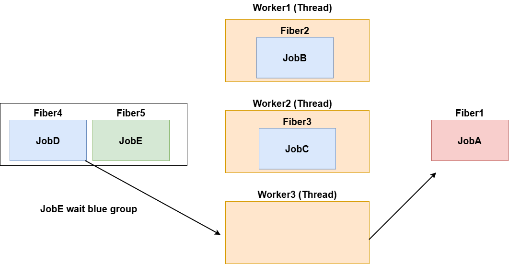

# JobApi

並列処理とは、複数の CPU コアなどを利用して、同時に複数の処理を実行することです。並行処理とは、複数の処理を進行させることです。並行処理は、1つの CPU コアで処理を切り替えながら実行する場合も、複数のコアで並列に実行する場合もあります。

並列処理では、例えば、コア1で物理の衝突判定を行いながら、コア2で AI の計算を行えます。また、大量の衝突判定を2つのコアで分担することもできます。ただし、タスク間に依存関係がある場合は、実行順序と同期を適切に制御する必要があります。

並行処理では、ファイルのダウンロード中に別の処理を進めることができます。I/O 待ちなどで CPU を使用しない処理がある場合、その待ち時間に別の処理を実行することで CPU を効率的に活用できます。ただし、ブロッキング I/O を Job 内で呼んでも、自動的に fiber の待機に変換されるわけではありません。

## Worker と Job fiber

KaniVolcanoEngine の標準設定では、利用可能な並列数から1を引いた数の Worker スレッドを作成します。Worker 数は最低1です。また、初期 Job fiber 数は Worker 数の4倍です。

Worker は Job（処理の1単位）を実行するスレッドです。各 Worker は、起動した自分のスレッドを manager fiber に変換します。manager fiber は Worker 専用であり、共有する Job fiber のプールとは別です。

投入した Job は共有キューに入り、空いている Job fiber に割り当てられます。Worker は manager fiber から Job fiber に切り替えて処理を実行します。Job が完了するか、別の Job の完了を待つ場合は manager fiber に戻り、別の Job を実行できます。待機していた Job fiber は、依存する Job の完了後に別の Worker で再開される場合もあります。空き Job fiber が不足した場合は追加作成されます。

fiber の切り替えはアプリケーション側で行います。ただし、Job の作成、キューへの投入、同期、fiber の切り替えにもコストがあるため、すべての処理を並列にすれば速くなるわけではありません。



## 使用例

`Rotator` component が付与されたすべてのオブジェクトを、並列に回転させる `ParallelRotatorSystem` の例です。エンジンが提供する `Rotator` は、次のように回転速度を保持します。

```rust
use cgmath::Vector3;
use kani_volcano_engine::Component;

pub struct Rotator {
    pub speed: Vector3<f32>,
}

impl Component for Rotator {}
```

以下の例では、エンジンが提供する `Rotator` を import して使います。

```rust
use anyhow::Result;
use kani_volcano_engine::{EntityApi, JobApi, Rotator, TimeApi, UpdateContext, UpdateSystem};
use kani_volcano_math::Transform;

#[derive(Default)]
pub struct ParallelRotatorSystem {}

impl UpdateSystem for ParallelRotatorSystem {
    fn update(&mut self, context: &mut UpdateContext<'_>) -> Result<()> {
        // component を借用する前に、JobSystemHandle を取得する。
        let jobs = context.job_system()?;
        let dt = context.delta_seconds();

        let mut entries: Vec<_> = context.query2_mut::<Transform, Rotator>().collect();

        unsafe {
            jobs.scope(|scope| -> Result<()> {
                // 子 Job の投入前の処理は、呼び出し元のスレッドで実行される。

                // これから投入する子 Job の完了を管理するグループを作成する。
                let group = scope.group();

                for chunk in entries.chunks_mut(256) {
                    scope.spawn(&group, move || {
                        // このクロージャは Worker 上で実行される。
                        for (_, transform, rotator) in chunk {
                            transform.rotate(rotator.speed * dt);
                        }
                    })?;
                }

                // このグループに属するすべての Job の完了を待つ。
                scope.wait(&group)?;

                // 待機後の処理は、呼び出し元のスレッドで実行される。

                Ok(())
            })
        }??;
        Ok(())
    }
}
```

`context.job_system()` は、エンジンの JobSystem を利用するための `JobSystemHandle` を返します。Scheduler は update / fixed update stage の実行中、そのスレッドの TLS に handle を登録します。handle は Context を借用せずに取得できるため、その後で component を可変借用できます。

1. `jobs.scope(...)`：借用したデータを使う Job を作成できる範囲を開始します。scope の終了前に、その scope から投入したすべての Job の完了が保証されます。明示的な `wait()` を省略した場合も同様です。
2. `scope.group()`：投入する Job の完了をまとめて管理するグループを作成します。
3. `scope.spawn(&group, func)`：`func`（`FnOnce() + Send`）を Job として共有キューに投入し、指定したグループに登録します。この例では、重複しない256件ずつの範囲を各 Job に渡します。
4. `scope.wait(&group)`：指定したグループに属するすべての Job の完了を待ちます。この呼び出しでグループは追加投入を禁止する状態になるため、以降の Job には新しいグループを使います。

例えば、処理 A の後に Job B・C・D を並列に実行し、その結果を使って処理 E を行いたい場合、B・C・D を同じグループに登録します。A を実行してから子 Job を投入し、`scope.wait(&group)?` の後に E を実行します。scope のクロージャ自体は自動的に Job になるわけではありません。

現在の Scheduler から呼ばれる `update()` は main thread 上で実行されます。上の例では、main thread が子 Job の完了を待ち、完了後に後続処理を続けます。Worker 上の Job が `wait()` を呼ぶ場合は、その Job fiber が停止し、Worker はほかの Job を実行できます。

最後の `??` は、`scope()` 自体のエラーと、そのクロージャが返す `Result` の両方を伝播させます。

## unsafe の条件

現在の `scope()` と `wait()` は `unsafe` です。Worker 上で呼ぶ場合、停止した fiber が別の Worker で再開される可能性があるため、呼び出し元のフレームも含むスタック全体の値と参照が、その移動に対応している必要があります。スレッドに依存するガード、TLS への参照、`Send` でない値などを、待機をまたいで保持しないでください。`Send` なクロージャでも、その内部で作成するローカル変数まで移動可能とは限りません。

また、自分自身を含むグループの完了待ちや、循環する依存関係は避けてください。

## 並列化に向いている処理

この `ParallelRotatorSystem` は使い方を示す例であり、軽い回転処理の高速化には向いていません。各オブジェクトの更新は、回転速度と時間の乗算、および回転角度への加算が中心です。更新時に行列計算を行っているわけではありません。

1 Job あたりの計算量が小さいと、Job の投入、同期、fiber の切り替えによるコストが、並列化による時間短縮を上回ります。さらに、この例では query 結果を `Vec` に収集する処理も直列です。今回の測定では、並列版より直列の `RotatorSystem` の方が高速でした。

並列化する場合は、1 Job が担当する件数を増やして Job 数を減らすか、次のような計算量の多い処理を対象にし、実測して比較してください。

- アニメーションの補間やボーン行列の計算
- AI の経路探索
- 独立した衝突候補の判定
- 地形や mesh の頂点・index・法線の生成

Job 間で可変データへの参照が重複しないように分割し、GPU 操作などスレッドに制約のある処理は、計算結果を集約した後で適切なスレッドから実行します。
